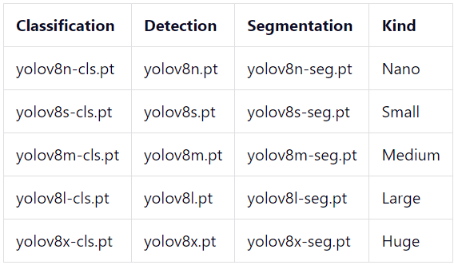

# About yolov8*.pt
YOLOv8 is a group of neural network models. These models were created and trained using PyTorch and exported to files with the .pt extension.
There are three types of models and 5 models of different sizes for each type:  

  

```
The bigger the model you choose, the better the prediction 
quality you can achieve, but the slower it will work.
```